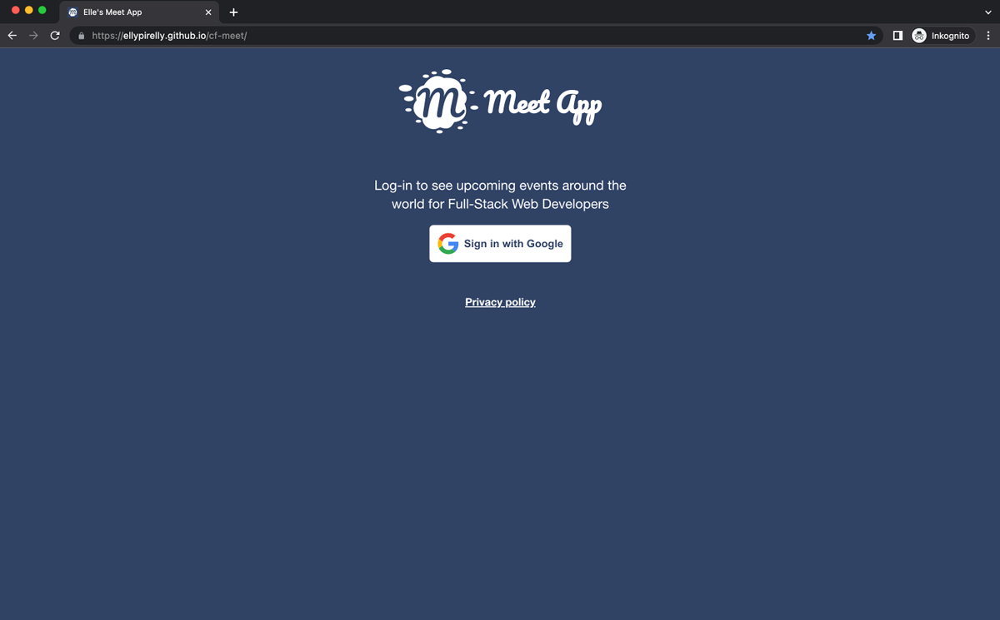
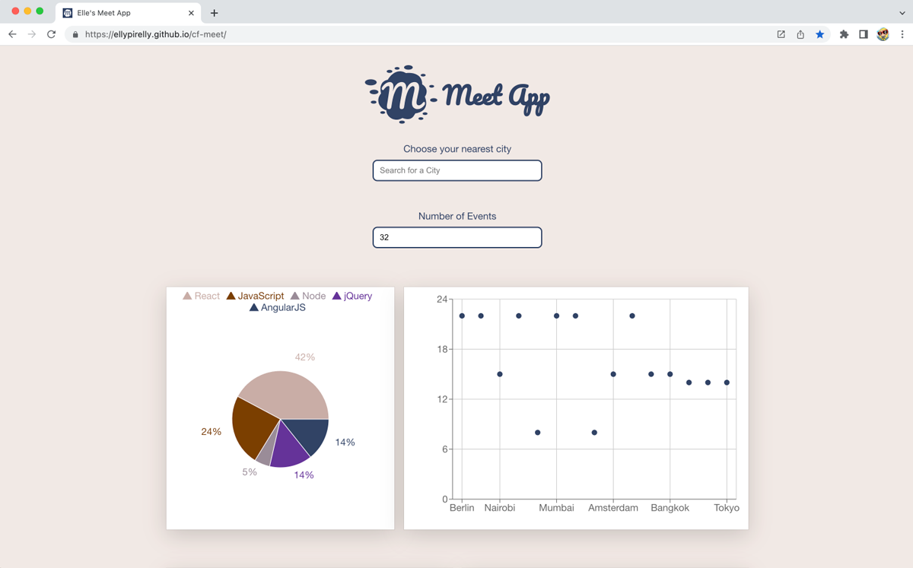
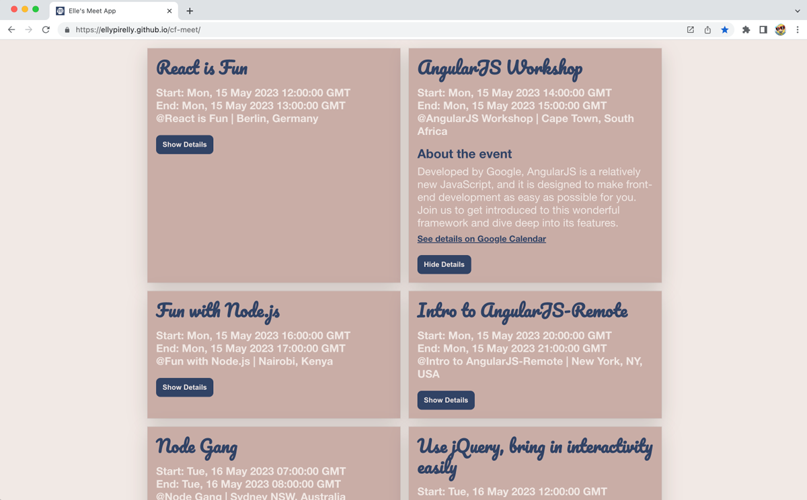
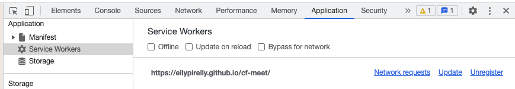
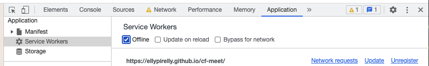
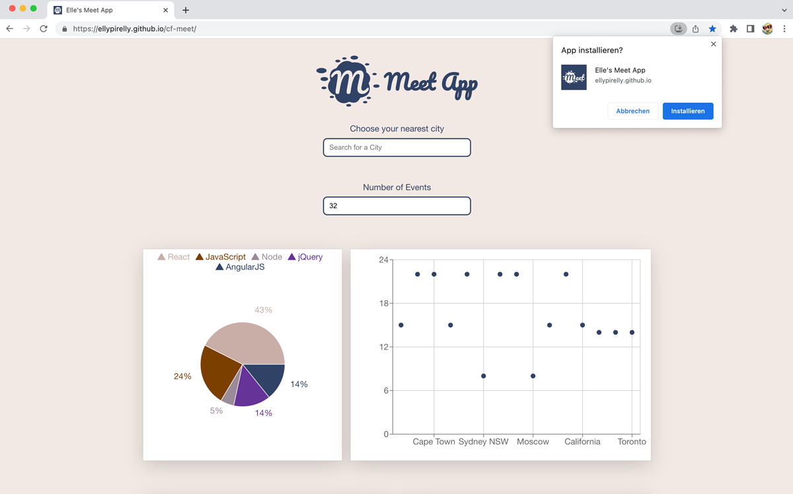
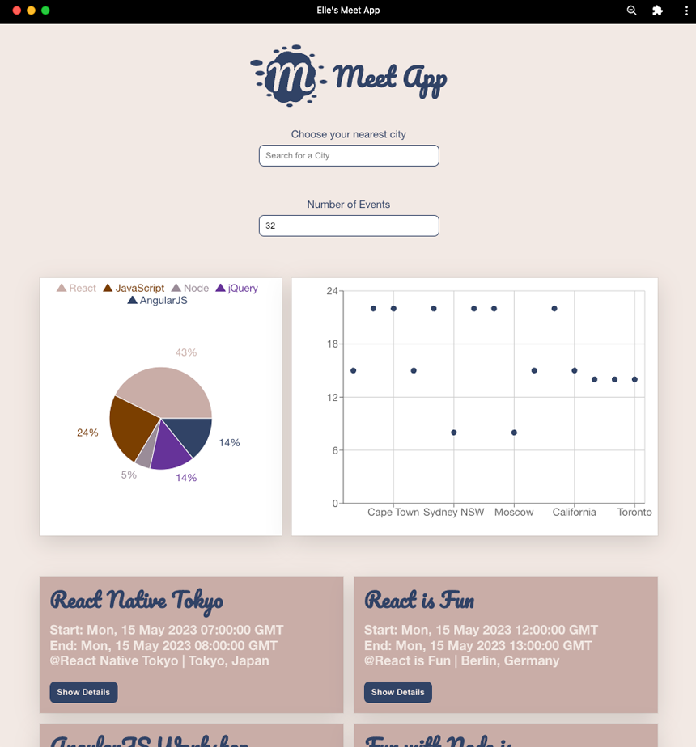
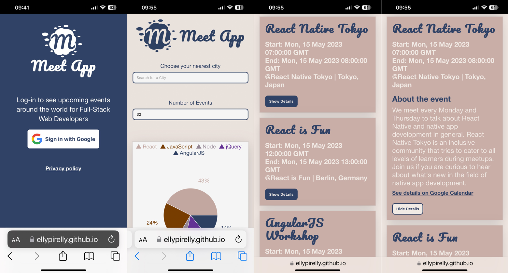
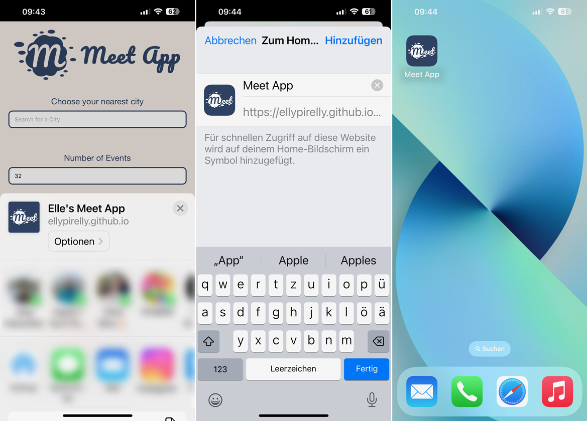

# Meet App

### What is this about?
A serverless, progressive web application with React, using a Test Driven Development approach. The application has implemented authentication and authorization and uses the Google Calendar API to fetch upcoming events off of a specified calendar.
<br>
This PWA has been built as a task for Achievement 4 in [Career Foundry's Full-Stack Web Development Program](https://careerfoundry.com/en/courses/become-a-web-developer/).
<br>
<br>
**Heads-up:**<br>
At time of writing the Meet App is not verified by Google, so Publishing Status is still in Testing state.
This means that as a curious user you won't be able to see the Meet App unless I add you as a test user with your gmail address.

 <br>
 <br>
 <br>

[The Meet App](#the-meet-app) <br>
[Tech](#tech) <br>
[Testing Serverless Functions locally](#testing-serverless-functions-locally)<br>
[TDD and BDD](#tdd-and-bdd) <br>
[How to run tests](#how-to-run-tests) <br>
[PWA and Service Worker](#pwa-and-service-worker) <br>
[How to run this](#how-to-run-this) <br>

## The Meet App
### Features
With the Meet APP, the user is able to
- filter events by city name
- specify the number of events being shown
- show/hide event details
- use the app when offline
- add an app shortcut to the home screen (mobile / desktop)
- view a chart showing the number of upcoming events by city

## Tech
### Infrastructure
- Frontend: React App, hosted on GitHub Pages
- Backend (Server Logic): Node.js, Express, AWS Lambda Serverless Functions (FaaS)
- Backend (Database): Google Calendar API

Initially a React 18 App was created, then downgraded to React 17, as this App must have been tested with Enzyme - at time of writing supported Enzyme Adapter is only available for React 17.

### Technical Requirements
The Meet App
- must be a React application
- must be build using Test Driven Development
- must use the Google Calendar API and OAuth2 for authentication
  - Google Calendar "fullstackwebdev" provided by CareerFoundry, populated with events
  - must have a Welcome Screen where user can log in with their Google credentials (or create those Google credentials)
- must use AWS Lambda Serverless Functions for authorization
- must be hosted on GitHub, deployed on GitHub Pages
- must be responsive (320px ... 1920px)
- must use React Axios and async/await
- must have a test coverage rate >= 90%
- must be monitored using an online monitoring tool (atatus)
- must support latest browser versions and IE11
- must have an alerts/warning for specified use cases implemented, using an object-oriented programming approach
- must pass the [lighthouse check](https://developer.chrome.com/docs/lighthouse/overview/) for PWAs
- must have valid Favicons, icons, `manifest.json` - those need customization for PWA
- must work offline or in slow networks with the help of a service worker
- must enable a user to install the app on desktop, add the app to their home screen on mobile
- must make use of data visualization

### Main Languages, Libraries
- HTML
- CSS
- JavaScript
- React

### OAuth2
- (protected) Google Calendar API
- read-only access
- to retrieve data, client-side needs to be authorized
- OAuth method/framework for authentication and authorization is handled by Google (as secure third-party service)

### Authorization server via AWS Lambda Serverless Functions (FaaS)
- used for authorization instead of a traditional server
- hosts following Serverless Functions:
- `getAuthURL()`
	- once invoked an authorization URL is returned
	- Google displays Consent Page to user
	- user needs to authorize
	- once authorized, user is redirected to Meet App with code parameter in URI
- `getAccessToken()`
	- the received code parameter in the URI is passed to the function
	- function checks validity of code with Google
	- if ok, returns temporary access token
	- once received, temporary access token is saved as cookie in `localStorage`
- `getCalendarEvents()`
	- temporary access token in `localStorage` is attached to the request, then used to receive events from Google Calendar API

#### Global Dependencies
- `serverless` toolkit
  - to create Serverless Functions, test them locally, deploy them using the command line
  - this is what generated `auth-server` and basic project set-up/files
- `http-server` to set up a local Node.js HTTP server

#### Dependencies
- `atatus-spa` application performance management tool
  - 14 day free trial used to track the Meet App
  - is deactived again
- `axios` to send requests from the React application to the authorization serverless endpoints
- `nprogress` and pre-given styling https://raw.githubusercontent.com/rstacruz/nprogress/master/nprogress.css to create and display a progress bar at the top of the page
- `recharts` for data visualization (ScatterChart and PieChart https://recharts.org/en-US)
- `react` via `react-create-app` and all packages coming with it

#### Dev Dependencies
- `Enzyme` for Shallow Rendering
- `@wojtekmaj/enzyme-adapter-react-17` Enzyme Adapter for React 17
- `gh-pages` to "automatically" build and deploy to `gh-pages` branch, see script in `package.json`
- `jest-cucumber` to use Gherkin-based test scenarios to drive acceptance tests
- `puppeteer` to test and simulate user interactions in a browser

#### auth-server Dependencies
- `googleapis` to securely send requests to the Google Calendar API (specific version `googleapis@^59.0.0` to not run into issues while following the Fullstack Program)

## Testing Serverless Functions Locally
Using a static site, to locally replicate the conditions under which the App will run and to test if all Serverless Functions that are already on AWS actually work. <br>
Heads-up: on AWS check if you’re in the correct region, in this example `eu-central-1`, otherwise server won’t work. <br>

 <br>
-	cd `static-site-test`
- open `test-auth-server.html`
- run `http-server`
- if necessary manually open `http://localhost:8080/`
- click the link `test-auth-server.html`
 <br>
- on `test-auth-server.html` <br>
 <br>
- follow click flow
- after clicking „Click to authorize“ you need the bit between `=` and `&` that’s returned via URL to then paste it into „Code input“ / „Get Token“

## TDD and BDD
Unit Testing | Integration Testing | User Acceptance Testing | End-to-End Testing | User Stories | Gherkin | Application Performance Monitoring

- mock data, retrieved on Google Calendar for specific calendar, via filling out the right hand panel
 <br>

### User Stories / Scenarios
User Story: <br>
As a user, I should be able to filter events by city, so I can see the list of events that take place in that city.
```
Feature: Filter events by city

Scenario: When user hasn’t searched for a city, show upcoming events from all cities.
Given user hasn’t searched for any city
When the user opens the app
Then the user should see the list of upcoming events.

Scenario: User should see a list of suggestions when they search for a city
Given the main page is open
When the user starts typing in the city textbox
Then the user should receive a list of cities (suggestions) that match what they’ve typed

Scenario: User can select a city from the suggested list
Given user was typing “Berlin” in the city textbox
And the list of suggested cities is showing
When the user selects a city (e.g., “Berlin, Germany”) from the list
Then their city should be changed to that city (i.e., “Berlin, Germany”)
And the user should receive a list of upcoming events in that city
```
User Story: <br>
As a user, I should be able to toggle event details, so I can either see a summarized event detail or en elaborate event detail
```
Feature: Toggle between showing or hiding details of one event

Scenario: An event element is collapsed by default.
Given the main page has been opened
And a list of events has been rendered
When the user has not clicked the toggle button
Then the event element should be collapsed.

Scenario: A user can expand an event element to see its details.
Given the main page has been opened
And a list of events has been rendered
When the user clicks the toggle button
Then the event element should expand and show the event element details.

Scenario: A user can collapse an event to hide its details.
Given an event element is expanded and has been showing event element details
When the user clicks the toggle button
Then the expanded event element should collapse.
```
User Story: <br>
As a user, I should be able to specify the number of events shown, so I can narrow down or extend the number of shown events.
```
Feature: Specify number of events

Scenario: When a user has not specified a number of events, 32 is the default number of events.
Given the main page has been opened
When the user does not specify the number of events
Then the number of events being shown per default should be 32.

Scenario: A user can change the number of events they want to see.
Given the main page has been opened
When the user inputs a specific number into the number input field
Then the user should only see the number of events they specified.
```

### Unit Testing
- Jest
- Enzyme for Shallow Rendering (allows rendering of components only one level deep)
- Enzyme Adapter (to correspond with React, supported version is React 17) https://www.npmjs.com/package/@wojtekmaj/enzyme-adapter-react-17

### Integration Testing
- Full Rendering API and Shallow Endering API

### User Acceptance Testing
- jest-cucumber
- BDD-style acceptance test framework
- how to create tests?
  - set up text based scenarios, like [in the filterEventsByCity.feature](./src/features/filterEventsByCity.feature)
  - generate very basic step definition / a test "skeleton", with:
  ```
  import { loadFeature, defineFeature } from 'jest-cucumber';

  const feature = loadFeature('./src/features/filterEventsByCity.feature');

  defineFeature(feature, test => {
    // here goes the tests to be
  });
  ```
  - run `npm run test`
  - will generate the skeleton in the terminal to copy and paste into `defineFeature()`

### End-to-End Testing
- puppeteer
	- works well with Jest
	- will automatically download the most recent, compatible version of Chromium

### Application Performance Monitoring
- atatus for error and performance tracking, etc., see examples below
 <br>
 <br>
 <br>

## How to run tests
Start the project
- run `npm run start` <br>

Run all three of the following tests, they display info differently, all of them are helpful
- run `npm run test`
- run `npm test -- --coverage`
- run `npx majestic`

## PWA Service Worker
- precondition for PWA, to enable offline use by way of showing user the same list of events loaded the previous time they launched the app, cached in `localStorage`
- registered via `serviceWorkerRegistration.register();` in `index.js`
- how to toggle a service worker test in Dev Tools
 <br>
 <br>
- `navigator.onLine` API is used to detect if user is online or not

### PWA - Desktop
Install?
 <br>
After install - Desktop App
 <br>
Icon on Desktop
 <br>

### PWA - Mobile
 <br>
 <br>

## How to run this?
- clone the repo
- `cd` into project
- `npm install`
- `npm run start` to start the local server on `http://localhost:3000/`

### How to deploy on `gh-pages` branch
- `npm run deploy` - this does not need an additional `git push`!
- `npm run predeploy` - should not be necessary as this should run in advance every time the project is deployed
- both commands are set up in `package.json`, like so:
```
  "scripts": {
    //
    "predeploy": "npm run build",
    "deploy": "gh-pages -d build"
  },
```
